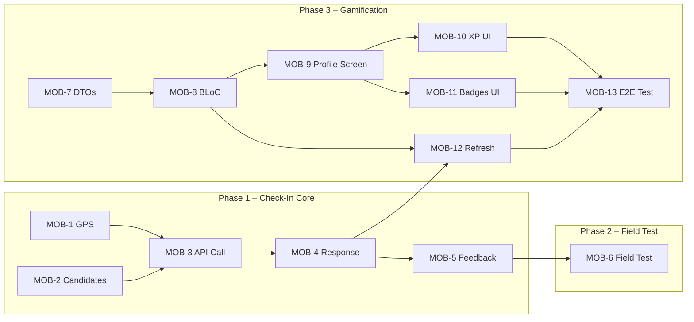

# MOBILE_SPRINT4_GUIDE.md

> **Vacanza Mobile — Sprint Implementation Guide**
> Epics: UC1.7 (Micro-Location Check-In) · UC1.9 (Gamified Travel Experience)
> Stack: Flutter 3.7+ · BLoC/Cubit · Mapbox Maps Flutter · Dio · Firebase Auth

---

## Table of Contents

1. [Sprint Roadmap](#a-sprint-roadmap)
2. [Task Breakdown (MOB-1 → MOB-13)](#task-breakdown)
3. [Definition of Done](#b-definition-of-done)
4. [Risk & Mitigation Table](#c-risk--mitigation-table)
5. [Quick Sanity Test Script](#d-quick-sanity-test-script)

---

## A) Sprint Roadmap

### Phase 1 — Check-In Core (MOB-1 → MOB-5)

| Order | Task   | Summary                          | Depends On        |
|-------|--------|----------------------------------|-------------------|
| 1     | MOB-1  | GPS tracking & permissions       | Auth (FReq1)      |
| 2     | MOB-2  | Candidate POI IDs from viewport  | POI data (FReq3)  |
| 3     | MOB-3  | POST /checkins/auto integration  | MOB-1, MOB-2      |
| 4     | MOB-4  | Response handling & local state  | MOB-3             |
| 5     | MOB-5  | Minimal user feedback (toast)    | MOB-4             |

### Phase 2 — UX & Field Testing (MOB-6)

| Order | Task   | Summary                             | Depends On      |
|-------|--------|-------------------------------------|-----------------|
| 6     | MOB-6  | Field test GPS edge cases           | MOB-1 → MOB-5   |

### Phase 3 — Gamification (MOB-7 → MOB-13)

| Order | Task   | Summary                              | Depends On       |
|-------|--------|---------------------------------------|-----------------|
| 7     | MOB-7  | Gamification DTOs & mapping           | Backend API     |
| 8     | MOB-8  | Fetch profile, store in BLoC/Cubit    | MOB-7           |
| 9     | MOB-9  | Profile screen layout (host)          | MOB-8           |
| 10    | MOB-10 | Render XP & Level widgets             | MOB-8, MOB-9    |
| 11    | MOB-11 | Render badges (icon mapping)          | MOB-8, MOB-9    |
| 12    | MOB-12 | Refresh gamification on check-in      | MOB-4, MOB-8    |
| 13    | MOB-13 | End-to-end integration test           | MOB-1 → MOB-12  |



---

## Task Breakdown

---

### MOB-1 — Foreground GPS Tracking & Permission Handling

#### 1) Overview
Implement continuous foreground GPS tracking using the `geolocator` package to power proximity-based auto check-in. Tracking must be lifecycle-aware — active only while the map screen is visible. Foreground-only location permission; no background tracking in this sprint.

#### 2) Dependencies
- Authenticated user context (FReq1 — `AuthRepository` + `SecureStorageService`)
- `geolocator` and `permission_handler` packages (new `pubspec.yaml` dependencies)

#### 3) API / DTO Contract Impact
None. GPS data stays client-side until sent in MOB-3.

#### 4) Suggested Files / Modules

| Action   | Path |
|----------|------|
| NEW      | `lib/features/checkin/data/services/location_service.dart` |
| NEW      | `lib/features/checkin/presentation/bloc/location_bloc.dart` |
| NEW      | `lib/features/checkin/presentation/bloc/location_event.dart` |
| NEW      | `lib/features/checkin/presentation/bloc/location_state.dart` |
| MODIFY   | `pubspec.yaml` — add `geolocator`, `permission_handler` |
| MODIFY   | `android/app/src/main/AndroidManifest.xml` — `ACCESS_FINE_LOCATION` |
| MODIFY   | `ios/Runner/Info.plist` — `NSLocationWhenInUseUsageDescription` |

#### 5) Step-by-Step Implementation Plan

- [ ] Add `geolocator` and `permission_handler` using the project's pinned/approved versions (no `latest`) to `pubspec.yaml`
- [ ] Add Android `ACCESS_FINE_LOCATION` and iOS `NSLocationWhenInUseUsageDescription` entries
- [ ] Create `LocationService` wrapper class:
  - `Future<bool> requestPermission()` — request + check status
  - `Stream<Position> positionStream({interval})` — wraps `Geolocator.getPositionStream` with high accuracy, `distanceFilter: 5`
  - `Future<Position> getCurrentPosition()` — single shot
- [ ] Create `LocationBloc`:
  - Events: `StartTracking`, `StopTracking`, `LocationUpdated(lat, lng)`
  - States: `LocationInitial`, `LocationPermissionDenied`, `LocationTracking(lat, lng)`, `LocationError(message)`
- [ ] On `StartTracking`: check permission → if denied, emit `LocationPermissionDenied` → if granted, subscribe to position stream → emit `LocationTracking` on each update
- [ ] On `StopTracking`: cancel stream subscription
- [ ] Wire lifecycle: start tracking on `HomeMapScreen` `initState`, stop on `dispose` (or use `WidgetsBindingObserver` for app lifecycle)
- [ ] Normalize output as simple `(double lat, double lng)` tuple for downstream

#### 6) Edge Cases & Failure Handling

| Scenario | Handling |
|----------|----------|
| Permission denied | Emit `LocationPermissionDenied`; show rationale dialog once; do not re-prompt until next session |
| Permission denied permanently | Open app settings with `Geolocator.openAppSettings()` |
| GPS unavailable / timeout | Emit `LocationError`; keep retrying silently on next stream event |
| App backgrounded | Stop stream subscription; resume on foreground via `WidgetsBindingObserver.didChangeAppLifecycleState` |
| Emulator / no GPS hardware | Fallback to last known position; log warning |

#### 7) Acceptance Criteria

- [ ] App continuously receives GPS coordinates while HomeMapScreen is active
- [ ] Permission denial is handled gracefully with user-facing message
- [ ] Location updates stop when app goes background / screen is disposed
- [ ] `LocationBloc` state is consumable by other BLoCs (check-in)
- [ ] No crash on permission denial or GPS timeout

#### 8) Commit Message Suggestion
```
feat(MOB-1): foreground GPS tracking with permission handling

- Add LocationService (geolocator wrapper)
- Add LocationBloc with lifecycle-aware start/stop
- Configure Android/iOS permission entries
```

---

### MOB-2 — Manage Candidate POI IDs From Map Viewport

#### 1) Overview
Maintain a live list of POI IDs (`candidatePoiIds`) visible within the current Mapbox viewport. This list feeds into the auto check-in request payload (MOB-3). It leverages the existing `MapboxView.onViewportBbox` callback and POI search results already loaded via `PoiSearchBloc`.

#### 2) Dependencies
- Existing `MapboxView` with `onViewportBbox(BboxArea)` callback
- Existing `PoiSearchBloc` / `PoiSearchState` holding loaded `List<Poi>`
- Existing `Poi` model (`lib/features/poi_search/data/models/poi.dart`) with `poiId`, `latitude`, `longitude`

#### 3) API / DTO Contract Impact
None. This is purely client-side viewport filtering.

#### 4) Suggested Files / Modules

| Action   | Path |
|----------|------|
| NEW      | `lib/features/checkin/presentation/bloc/candidate_poi_cubit.dart` |
| NEW      | `lib/features/checkin/presentation/bloc/candidate_poi_state.dart` |
| MODIFY   | `lib/features/map/presentation/widgets/home_map/mapbox/mapbox_view.dart` — ensure `onViewportBbox` provides bounds to `CandidatePoiCubit` |
| MODIFY   | `lib/features/map/presentation/screens/home_map_screen.dart` — wire cubit, listen to poi search state |

#### 5) Step-by-Step Implementation Plan

- [ ] Create `CandidatePoiCubit` (Cubit, not full Bloc — simple state):
  - State: `CandidatePoiState { List<String> candidatePoiIds }`
  - Method: `updateFromViewport(BboxArea bbox, List<Poi> loadedPois)` → filter POIs whose lat/lng fall inside bbox → emit new `candidatePoiIds`
- [ ] In `HomeMapScreen`, listen to both `onViewportBbox` and `PoiSearchBloc` state changes:
  - On bbox update or poi list update → call `candidatePoiCubit.updateFromViewport(bbox, pois)`
- [ ] Expose `candidatePoiIds` getter on cubit state for check-in flow consumption
- [ ] Verify no backend "nearby POI" query is issued from mobile — all filtering is client-side

#### 6) Edge Cases & Failure Handling

| Scenario | Handling |
|----------|----------|
| Zero POIs in viewport | `candidatePoiIds` = empty list; check-in trigger skipped (MOB-3 won't fire) |
| Rapid pan/zoom | Debounce already handled by `MapboxView._scheduleViewportBbox` (500ms) |
| POI search still loading | Use current (possibly stale) list; refresh when search completes |
| Very large viewport (many POIs) | No cap needed; backend picks closest from candidates |

#### 7) Acceptance Criteria

- [ ] Only POIs currently visible on the map are included in `candidatePoiIds`
- [ ] Candidate list updates correctly on pan/zoom (after debounce)
- [ ] Empty candidate list does not cause errors downstream
- [ ] No duplicate backend "nearby" query from mobile side

#### 8) Commit Message Suggestion
```
feat(MOB-2): candidate POI IDs from map viewport

- Add CandidatePoiCubit with bbox-based filtering
- Wire to MapboxView.onViewportBbox and PoiSearchBloc
```

---

### MOB-3 — Integrate Auto Check-In API Call (POST /checkins/auto)

#### 1) Overview
Create the API client and repository layer to call `POST /checkins/auto` with the user's GPS coordinates and candidate POI IDs. Requests are throttled, authenticated via Firebase token (already handled by `JwtInterceptor`), and failure-safe.

#### 2) Dependencies
- MOB-1 (`LocationBloc` provides lat/lng)
- MOB-2 (`CandidatePoiCubit` provides `candidatePoiIds`)
- `JwtInterceptor` (existing — auto-attaches Bearer token)
- Shared `Dio` instance from `createAppDio()`

#### 3) API / DTO Contract Impact

**Request DTO:**
```
POST /checkins/auto
Authorization: Bearer <FirebaseIdToken>
{
  "latitude": Double,
  "longitude": Double,
  "candidatePoiIds": List<UUID>
}
```

**Response DTO** — see MOB-4.

#### 4) Suggested Files / Modules

| Action   | Path |
|----------|------|
| NEW      | `lib/features/checkin/data/api/checkin_api_client.dart` |
| NEW      | `lib/features/checkin/data/models/auto_checkin_request_dto.dart` |
| NEW      | `lib/features/checkin/data/models/auto_checkin_response_dto.dart` |
| NEW      | `lib/features/checkin/data/repositories/checkin_repository.dart` |
| NEW      | `lib/features/checkin/presentation/bloc/checkin_bloc.dart` |
| NEW      | `lib/features/checkin/presentation/bloc/checkin_event.dart` |
| NEW      | `lib/features/checkin/presentation/bloc/checkin_state.dart` |
| MODIFY   | DI composition root (e.g., `main.dart` / `injection_container.dart` / `di.dart`) — register `CheckinApiClient`, `CheckinRepository`, `CheckinBloc` |

#### 5) Step-by-Step Implementation Plan

- [ ] Create `AutoCheckinRequestDto`:
  - Fields: `double latitude`, `double longitude`, `List<String> candidatePoiIds`
  - Method: `Map<String, dynamic> toJson()`
- [ ] Create `AutoCheckinResponseDto` (see MOB-4 for full detail):
  - Fields: `String? checkInId`, `String? poiId`, `String? poiName`, `String? checkedInAt`, `String message`, `bool success`, `bool gamificationTriggered`
  - Factory: `fromJson(Map<String, dynamic>)`
- [ ] Create `CheckinApiClient`:
  - Constructor injects `Dio`
  - Method: `Future<AutoCheckinResponseDto> autoCheckin(AutoCheckinRequestDto req)` → `POST /checkins/auto`
- [ ] Create `CheckinRepository`:
  - Wraps `CheckinApiClient`; maps `DioException` → domain errors
- [ ] Create `CheckinBloc`:
  - Event: `TriggerAutoCheckin(lat, lng, candidatePoiIds)`
  - States: `CheckinInitial`, `CheckinLoading`, `CheckinSuccess(response)`, `CheckinFailure(message)`
  - **Throttling**: ignore `TriggerAutoCheckin` if last call was < 10 seconds ago (configurable `_throttleDuration`)
  - Guard: skip if `candidatePoiIds` is empty
- [ ] Register in DI composition root (e.g., `main.dart` / `injection_container.dart`):
  - `RepositoryProvider<CheckinApiClient>` + `RepositoryProvider<CheckinRepository>`
  - `BlocProvider<CheckinBloc>`
- [ ] Wire trigger: in `HomeMapScreen`, listen to `LocationBloc` + `CandidatePoiCubit` → on each location update (with candidates available), dispatch `TriggerAutoCheckin`

#### 6) Edge Cases & Failure Handling

| Scenario | Handling |
|----------|----------|
| Empty `candidatePoiIds` | Skip API call; remain in current state |
| Network error / timeout | Emit `CheckinFailure`; do not crash; next location tick retries |
| 401 Unauthorized | `JwtInterceptor` handles token refresh + retry automatically |
| 429 Too Many Requests | Increase throttle backoff; log warning |
| Malformed response | Catch `FormatException` in repository; emit `CheckinFailure` |
| User not authenticated | Skip call; `JwtInterceptor` lacks token → request fails silently |

#### 7) Acceptance Criteria

- [ ] Requests are sent only for authenticated users (token auto-attached)
- [ ] Payload includes current latitude/longitude and `candidatePoiIds`
- [ ] Calls are throttled (≥10s between requests)
- [ ] Failures do not crash the app
- [ ] API call skipped when `candidatePoiIds` is empty

#### 8) Commit Message Suggestion
```
feat(MOB-3): integrate POST /checkins/auto API call

- Add CheckinApiClient, DTOs, CheckinRepository
- Add CheckinBloc with throttled trigger
- Register in DI composition root
```

---

### MOB-4 — Handle Auto Check-In Response & Update Local State (Idempotent)

#### 1) Overview
Parse the `POST /checkins/auto` response and update local state only when a new check-in is created (`checkInId != null`). Duplicate and no-match responses are handled gracefully without state mutation.

#### 2) Dependencies
- MOB-3 (`CheckinBloc` and `AutoCheckinResponseDto`)

#### 3) API / DTO Contract Impact

**Response DTO fields** (all HTTP 200):

| Field | Type | New Check-In | Duplicate | No POI in Range |
|-------|------|-------------|-----------|-----------------|
| `checkInId` | UUID / null | `"uuid"` | `null` | `null` |
| `poiId` | UUID / null | `"uuid"` | `"uuid"` | `null` |
| `poiName` | String / null | `"name"` | `"name"` | `null` |
| `checkedInAt` | ISO8601 / null | `"2026-..."` | `null` | `null` |
| `message` | String | `"Checked in!"` | `"Already checked in"` | `"No matching POI within 50.0m"` |
| `success` | bool | `true` | `true` | `false` |
| `gamificationTriggered` | bool | `true` | `false` | `false` |

#### 4) Suggested Files / Modules

| Action   | Path |
|----------|------|
| MODIFY   | `lib/features/checkin/presentation/bloc/checkin_bloc.dart` — response parsing logic |
| MODIFY   | `lib/features/checkin/presentation/bloc/checkin_state.dart` — add `CheckinNewCreated`, `CheckinDuplicate`, `CheckinNoMatch` states |
| MODIFY   | `lib/features/checkin/data/models/auto_checkin_response_dto.dart` — ensure null-safe parsing |

#### 5) Step-by-Step Implementation Plan

- [ ] Refine `CheckinState` subtypes:
  - `CheckinNewCreated(AutoCheckinResponseDto response)` — when `checkInId != null`
  - `CheckinDuplicate(AutoCheckinResponseDto response)` — when `success == true && checkInId == null`
  - `CheckinNoMatch(String message)` — when `success == false`
- [ ] In `CheckinBloc`, after successful API call:
  - Parse `AutoCheckinResponseDto`
  - If `response.checkInId != null` → emit `CheckinNewCreated(response)`
  - Else if `response.success == true` → emit `CheckinDuplicate(response)`
  - Else → emit `CheckinNoMatch(response.message)`
- [ ] Ensure `AutoCheckinResponseDto.fromJson` handles `null` values for `checkInId`, `poiId`, `poiName`, `checkedInAt` without throwing
- [ ] (Optional optimization) Keep a short-lived in-memory set of recently seen `poiId`s to reduce repeated UI work/log spam; do not rely on it for correctness. Backend remains source of truth for duplicates.
- [ ] Preserve `gamificationTriggered` in state so MOB-12 can decide refresh

#### 6) Edge Cases & Failure Handling

| Scenario | Handling |
|----------|----------|
| `checkedInAt == null` | Safe — duplicate/no-op; do not parse as DateTime |
| `checkInId == null` but `success == true` | Duplicate; no state mutation |
| Unknown/extra fields in response | `fromJson` ignores unknown keys |
| `gamificationTriggered == true` | Delegate to MOB-12; this task only sets the flag in state |

#### 7) Acceptance Criteria

- [ ] New check-in (`checkInId != null`) triggers local state update
- [ ] Duplicate (`success=true, checkInId=null`) does not mutate state
- [ ] No-match (`success=false`) is handled silently
- [ ] `checkedInAt == null` does not throw
- [ ] `gamificationTriggered` flag is preserved in state for MOB-12

#### 8) Commit Message Suggestion
```
feat(MOB-4): handle auto check-in response with idempotent state

- Add CheckinNewCreated, CheckinDuplicate, CheckinNoMatch states
- Null-safe DTO parsing for all response scenarios
- Preserve gamificationTriggered flag for MOB-12 refresh
```

---

### MOB-5 — Show Minimal User Feedback on New Check-In Only

#### 1) Overview
Display a non-blocking toast/snackbar only when the backend confirms a newly created check-in. No feedback for duplicate, no-match, or error outcomes.

#### 2) Dependencies
- MOB-4 (`CheckinNewCreated` state)
- Existing `NavigationService.showSnackBar()` pattern (from `JwtInterceptor._forceLogout`)

#### 3) API / DTO Contract Impact
None.

#### 4) Suggested Files / Modules

| Action   | Path |
|----------|------|
| NEW      | `lib/features/checkin/presentation/widgets/checkin_feedback_listener.dart` |
| MODIFY   | `lib/features/map/presentation/screens/home_map_screen.dart` — wrap with feedback listener |

#### 5) Step-by-Step Implementation Plan

- [ ] Create `CheckinFeedbackListener` widget (wraps `BlocListener<CheckinBloc, CheckinState>`):
  - On `CheckinNewCreated` → show `SnackBar` with `"✓ Checked in at ${response.poiName ?? 'this place'}!"` using `ScaffoldMessenger`
  - On `CheckinDuplicate`, `CheckinNoMatch`, `CheckinFailure` → no-op
  - Snackbar config: duration 2s, `SnackBarBehavior.floating`, dismissible
- [ ] Wrap `HomeMapScreen` body with `CheckinFeedbackListener`
- [ ] Ensure snackbar does not block map interaction (floating behavior)

#### 6) Edge Cases & Failure Handling

| Scenario | Handling |
|----------|----------|
| `poiName == null` | Show generic "Checked in!" message |
| Rapid successive check-ins | `ScaffoldMessenger.clearSnackBars()` before showing new one |
| Screen disposed during snackbar | Standard Flutter disposal handles this |

#### 7) Acceptance Criteria

- [ ] User is informed only when a new check-in is created
- [ ] Feedback does not interrupt navigation or map interaction
- [ ] No feedback shown for duplicate/no-op/error outcomes
- [ ] Toast disappears after ~2 seconds

#### 8) Commit Message Suggestion
```
feat(MOB-5): non-blocking check-in feedback toast

- Add CheckinFeedbackListener (BlocListener)
- Show snackbar only on CheckinNewCreated
```

---

### MOB-6 — Field Testing & GPS Edge Case Validation (UC1.7)

#### 1) Overview
Validate auto check-in behavior under real GPS field conditions. This is a testing/validation task, not a code-heavy task. Focus on documenting observed behavior and tuning parameters.

#### 2) Dependencies
- MOB-1 through MOB-5 fully integrated and working

#### 3) API / DTO Contract Impact
None.

#### 4) Suggested Files / Modules

| Action   | Path |
|----------|------|
| NEW      | `docs/field_test_results.md` — test observations log |
| MODIFY   | `lib/features/checkin/data/services/location_service.dart` — tune `distanceFilter`, polling interval if needed |
| MODIFY   | `lib/features/checkin/presentation/bloc/checkin_bloc.dart` — tune throttle duration based on field results |

#### 5) Step-by-Step Implementation Plan

- [ ] Prepare test plan: identify 3+ real POIs with known coordinates
- [ ] Test scenario 1: Walk toward POI, observe check-in trigger at ≤50m
- [ ] Test scenario 2: Stand at boundary (~45–55m), observe detection consistency
- [ ] Test scenario 3: Rapid movement (car/tram) past a POI — observe if check-in fires
- [ ] Test scenario 4: Indoor GPS drift — observe false positives / negatives
- [ ] Test scenario 5: Airplane mode toggle — observe recovery behavior
- [ ] Record: latency from entering radius → check-in confirmation
- [ ] Tune `distanceFilter`, throttle duration, GPS accuracy mode based on results
- [ ] Document findings in `docs/field_test_results.md`

#### 6) Edge Cases & Failure Handling

| Scenario | Handling |
|----------|----------|
| GPS drift causes false check-in | Accept as prototype limitation; document threshold |
| ~50m boundary oscillation | Backend decides proximity; client just sends candidates |
| High latency (>10s) | Reduce throttle interval; increase polling frequency |
| Detection rate <80% | Tune `distanceFilter` down; consider shorter polling interval |

#### 7) Acceptance Criteria

- [ ] Check-in confirmation observed shortly after entering radius (best-effort)
- [ ] Detection accuracy reaches ~80% in field conditions (prototype target)
- [ ] No critical crashes/blockers during demo scenario
- [ ] Tuning parameters documented

#### 8) Commit Message Suggestion
```
test(MOB-6): field test results and GPS parameter tuning

- Document field test observations
- Tune distanceFilter and throttle based on results
```

---

### MOB-7 — Define Gamification DTO Models & Mapping (GET /gamification/profile)

#### 1) Overview
Create Flutter model classes matching the backend gamification profile response. Models must be null-safe, reusable across UI and state layers, and resilient to missing/empty arrays.

#### 2) Dependencies
- Backend `GET /gamification/profile` contract finalized

#### 3) API / DTO Contract Impact

**Response:**
```json
{
  "roleText": "Urban Adventurer",
  "levelText": "Level 5",
  "xpProgressPercent": 45,
  "xpToNextLevel": 500,
  "totalXp": 1225,
  "badgesSectionTitle": "Achievement Badges",
  "stats": [{ "label": "Places", "value": 12 }],
  "badges": [{ "id": 1, "title": "First Step", "key": "speed", "earned": true }]
}
```

#### 4) Suggested Files / Modules

| Action   | Path |
|----------|------|
| NEW      | `lib/features/gamification/data/models/gamification_profile_dto.dart` |
| NEW      | `lib/features/gamification/data/models/badge_dto.dart` |
| NEW      | `lib/features/gamification/data/models/stat_dto.dart` |

#### 5) Step-by-Step Implementation Plan

- [ ] Create `StatDto`:
  - Fields: `String label`, `int value`
  - Factory: `fromJson(Map<String, dynamic>)` — safe `toString()` for label, `as int? ?? 0` for value
- [ ] Create `BadgeDto`:
  - Fields: `int id`, `String title`, `String key`, `bool earned`
  - Factory: `fromJson(Map<String, dynamic>)` — safe defaults for all fields
- [ ] Create `GamificationProfileDto`:
  - Fields: `String roleText`, `String levelText`, `int xpProgressPercent`, `int xpToNextLevel`, `int totalXp`, `String badgesSectionTitle`, `List<StatDto> stats`, `List<BadgeDto> badges`
  - Factory: `fromJson(Map<String, dynamic>)`:
    - Parse `stats` as `List` → `.map(StatDto.fromJson)` with empty-list fallback
    - Parse `badges` as `List` → `.map(BadgeDto.fromJson)` with empty-list fallback
    - Clamp `xpProgressPercent` to 0–100

#### 6) Edge Cases & Failure Handling

| Scenario | Handling |
|----------|----------|
| `stats` or `badges` is `null` | Default to empty list `[]` |
| `xpProgressPercent > 100` or `< 0` | Clamp to 0–100 in DTO layer |
| Unknown fields in JSON | Ignore (no `JsonKey(required)` enforcement) |
| Non-integer `value` in stats | Safe cast via `(json['value'] as num?)?.toInt() ?? 0` |

#### 7) Acceptance Criteria

- [ ] Models map cleanly to the API response fields
- [ ] Empty/missing arrays parsed safely (no crash)
- [ ] Models reusable in UI + state management layers
- [ ] Unit-testable `fromJson` factories

#### 8) Commit Message Suggestion
```
feat(MOB-7): gamification DTO models (profile, badge, stat)

- Add GamificationProfileDto, BadgeDto, StatDto
- Null-safe fromJson with empty-array fallbacks
```

---

### MOB-8 — Fetch Gamification Profile & Store in State (BLoC/Cubit)

#### 1) Overview
Create an API client and Cubit to fetch the authenticated user's gamification profile from `GET /gamification/profile` and store it for UI consumption.

#### 2) Dependencies
- MOB-7 (DTO models)
- `JwtInterceptor` for auth (existing)
- Shared `Dio` instance

#### 3) API / DTO Contract Impact
Uses `GET /gamification/profile` — no request body, response parsed via `GamificationProfileDto.fromJson`.

#### 4) Suggested Files / Modules

| Action   | Path |
|----------|------|
| NEW      | `lib/features/gamification/data/api/gamification_api_client.dart` |
| NEW      | `lib/features/gamification/data/repositories/gamification_repository.dart` |
| NEW      | `lib/features/gamification/presentation/cubit/gamification_cubit.dart` |
| NEW      | `lib/features/gamification/presentation/cubit/gamification_state.dart` |
| MODIFY   | DI composition root (e.g., `main.dart` / `injection_container.dart` / `di.dart`) — register `GamificationApiClient`, `GamificationRepository`, `GamificationCubit` |

#### 5) Step-by-Step Implementation Plan

- [ ] Create `GamificationApiClient`:
  - Constructor: `GamificationApiClient(Dio dio)`
  - Method: `Future<GamificationProfileDto> fetchProfile()` → `GET /gamification/profile` → parse response
- [ ] Create `GamificationRepository`:
  - Wraps `GamificationApiClient`; maps `DioException` to domain-level errors
  - Method: `Future<GamificationProfileDto> getProfile()`
- [ ] Create `GamificationState` (Equatable):
  - `GamificationInitial`
  - `GamificationLoading`
  - `GamificationLoaded(GamificationProfileDto profile)`
  - `GamificationError(String message)`
- [ ] Create `GamificationCubit`:
  - Method: `Future<void> fetchProfile()` → emit `Loading` → call repo → emit `Loaded` or `Error`
  - Method: `void refresh()` → re-fetch (used by MOB-12)
- [ ] Register in DI composition root (e.g., `main.dart` / `injection_container.dart`):
  - `RepositoryProvider<GamificationApiClient>`
  - `RepositoryProvider<GamificationRepository>`
  - `BlocProvider<GamificationCubit>`
- [ ] Trigger initial fetch when user navigates to Profile screen (lazy)

#### 6) Edge Cases & Failure Handling

| Scenario | Handling |
|----------|----------|
| Network error | Emit `GamificationError`; UI shows retry option |
| 401 Unauthorized | `JwtInterceptor` handles refresh automatically |
| Empty profile (new user) | `GamificationLoaded` with zero XP, empty badges — valid state |
| Concurrent fetches | Guard with `if (state is GamificationLoading) return` |

#### 7) Acceptance Criteria

- [ ] Gamification profile fetch works for authenticated users
- [ ] Error states handled without crashes
- [ ] UI can reliably consume the profile state via `BlocBuilder`
- [ ] `refresh()` method available for post-check-in refresh (MOB-12)

#### 8) Commit Message Suggestion
```
feat(MOB-8): gamification profile fetch with GamificationCubit

- Add GamificationApiClient, GamificationRepository
- Add GamificationCubit with fetch/refresh
- Register in DI composition root
```

---

### MOB-9 — Build Profile Screen Layout (Gamification Container UI)

#### 1) Overview
Create the gamification profile screen as a scrollable layout container with placeholder sections for XP/level (MOB-10) and badges (MOB-11). This task builds only the shell and navigation entry — the real section widgets are implemented in MOB-10 and MOB-11 and plugged into the slots defined here.

#### 2) Dependencies
- MOB-8 (`GamificationCubit` for state)

#### 3) API / DTO Contract Impact
None.

#### 4) Suggested Files / Modules

| Action   | Path |
|----------|------|
| NEW      | `lib/features/gamification/presentation/screens/gamification_profile_screen.dart` |
| MODIFY   | `lib/features/map/presentation/screens/home_map_screen.dart` or navigation — add route/entry to Profile |
| MODIFY   | `lib/core/navigation/navigation_service.dart` — add named route if needed |

#### 5) Step-by-Step Implementation Plan

- [ ] Create `GamificationProfileScreen` (StatelessWidget):
  - Wraps body in `BlocBuilder<GamificationCubit, GamificationState>`
  - Loading state → centered `CircularProgressIndicator`
  - Error state → error message + retry button
  - Loaded state → `SingleChildScrollView` with placeholder slots:
    1. **Header slot** — placeholder `Container` / `SizedBox` for profile header (implemented in MOB-10)
    2. **XP progress slot** — placeholder for XP bar widget (implemented in MOB-10)
    3. **Stats slot** — placeholder for stats row (implemented in MOB-10)
    4. Section title: `badgesSectionTitle`
    5. **Badges slot** — placeholder for badge grid (implemented in MOB-11)
  > MOB-10 and MOB-11 replace these placeholders with the real widgets.
- [ ] Add navigation entry: FAB, bottom nav item, or menu item on `HomeMapScreen` → navigates to `GamificationProfileScreen`
- [ ] Trigger `gamificationCubit.fetchProfile()` on screen init (if not already loaded)

#### 6) Edge Cases & Failure Handling

| Scenario | Handling |
|----------|----------|
| Profile not yet loaded | Show loading indicator; fetch on init |
| Very long badge list | Grid wraps; scroll handles overflow |
| Screen rotation | `SingleChildScrollView` + responsive layout |

#### 7) Acceptance Criteria

- [ ] Profile screen reachable from main navigation
- [ ] Layout stable and hosts XP/level/badges components
- [ ] No business logic in this screen — delegated to Cubit and child widgets
- [ ] Loading / error / loaded states all render correctly

#### 8) Commit Message Suggestion
```
feat(MOB-9): gamification profile screen layout (container shell)

- Add GamificationProfileScreen with placeholder section slots
- Add navigation entry from HomeMapScreen
```

---

### MOB-10 — Render XP & Level in Profile UI (Backend-Driven)

#### 1) Overview
Create reusable widgets that render the backend-driven header texts (`roleText`, `levelText`) and XP progress (`xpProgressPercent`, `xpToNextLevel`, `totalXp`). The UI displays values exactly as the backend provides — no client-side calculation.

#### 2) Dependencies
- MOB-8 (`GamificationCubit` / `GamificationProfileDto`)
- MOB-9 (host screen — layout container)

#### 3) API / DTO Contract Impact
Reads: `roleText`, `levelText`, `xpProgressPercent`, `xpToNextLevel`, `totalXp`, `stats[]`.

#### 4) Suggested Files / Modules

| Action   | Path |
|----------|------|
| NEW      | `lib/features/gamification/presentation/widgets/profile_header_section.dart` |
| NEW      | `lib/features/gamification/presentation/widgets/xp_progress_section.dart` |
| NEW      | `lib/features/gamification/presentation/widgets/stats_summary_row.dart` |

#### 5) Step-by-Step Implementation Plan

- [ ] Create `ProfileHeaderSection`:
  - Renders `roleText` as title, `levelText` as subtitle
  - Optional avatar/icon placeholder
- [ ] Create `XpProgressSection`:
  - `LinearProgressIndicator` with `value: xpProgressPercent / 100.0`
  - Text: `"${totalXp} XP"` and `"${xpToNextLevel} to next level"`
  - Animate progress bar on value change (implicit animation)
- [ ] Create `StatsSummaryRow`:
  - Horizontal row of `Column(label, value)` items from `stats[]`
  - Each stat rendered as `Text(stat.value.toString())` + `Text(stat.label)`
- [ ] All widgets receive data as constructor parameters (pure presentation — no BLoC dependency inside)

#### 6) Edge Cases & Failure Handling

| Scenario | Handling |
|----------|----------|
| `xpProgressPercent == 0` | Progress bar empty — valid |
| `xpProgressPercent == 100` | Progress bar full — valid |
| `stats` empty list | Hide stats row or show "No stats yet" |
| Very long `roleText` | Ellipsis overflow with `maxLines: 1` |

#### 7) Acceptance Criteria

- [ ] UI displays `roleText` and `levelText` exactly as backend provides
- [ ] `xpProgressPercent` renders correctly (0–100); UI does not calculate percent
- [ ] Stats row renders all items from `stats[]`
- [ ] Widgets are stateless and reusable

#### 8) Commit Message Suggestion
```
feat(MOB-10): XP, level, and stats UI widgets

- Add ProfileHeaderSection, XpProgressSection, StatsSummaryRow
- Backend-driven rendering with no client-side calculation
```

---

### MOB-11 — Render Earned Badges in Profile UI (Backend-Driven)

#### 1) Overview
Render badges from the backend `badges[]` array with icon mapping based on `key`. Earned badges are colored; unearned badges are greyed out. Unknown keys fall back to a default icon.

#### 2) Dependencies
- MOB-8 (`GamificationCubit` / `BadgeDto`)
- MOB-9 (host screen — layout container)

#### 3) API / DTO Contract Impact
Reads: `badges[{ id, title, key, earned }]`.

**Badge key → icon mapping:**

| Key        | Icon (Material)              |
|------------|------------------------------|
| `speed`    | `Icons.flash_on`             |
| `foodie`   | `Icons.restaurant`           |
| `culture`  | `Icons.museum`               |
| `nature`   | `Icons.park`                 |
| `explorer` | `Icons.explore`              |
| `<unknown>`| `Icons.emoji_events` (default)|

#### 4) Suggested Files / Modules

| Action   | Path |
|----------|------|
| NEW      | `lib/features/gamification/presentation/widgets/badge_grid_section.dart` |
| NEW      | `lib/features/gamification/presentation/widgets/badge_card.dart` |
| NEW      | `lib/features/gamification/presentation/utils/badge_icon_mapper.dart` |

#### 5) Step-by-Step Implementation Plan

- [ ] Create `badge_icon_mapper.dart`:
  - Function: `IconData badgeIconForKey(String key)` → switch on key, return corresponding `IconData`, default → `Icons.emoji_events`
  - Function: `Color badgeColor(String key, bool earned)` → earned = themed color per key; unearned = `Colors.grey`
- [ ] Create `BadgeCard` widget:
  - Accepts `BadgeDto badge`
  - Renders: icon (from mapper), title text below
  - If `earned == true`: icon colored, full opacity
  - If `earned == false`: icon greyed out, reduced opacity (0.4)
- [ ] Create `BadgeGridSection`:
  - `GridView.builder` or `Wrap` layout
  - Maps `List<BadgeDto>` → `BadgeCard` widgets
  - Handles empty list gracefully ("No badges yet")

#### 6) Edge Cases & Failure Handling

| Scenario | Handling |
|----------|----------|
| Unknown `key` value | Default icon (`Icons.emoji_events`) — no crash |
| Empty badges list | Show placeholder text |
| Very many badges (>20) | Grid scrolls within `SingleChildScrollView` |
| `earned` field missing (null) | Default to `false` in `BadgeDto.fromJson` |

#### 7) Acceptance Criteria

- [ ] Uses `earned` flag only (no client-side earned calculation)
- [ ] Unknown key does not crash — falls back to default icon
- [ ] Earned badges are colored; unearned are greyed out
- [ ] Layout stable for varying badge counts (0, 1, 5, 20)

#### 8) Commit Message Suggestion
```
feat(MOB-11): badge grid with key-to-icon mapping

- Add BadgeIconMapper, BadgeCard, BadgeGridSection
- Earned=colored, unearned=grey, unknown=default icon
```

---

### MOB-12 — Refresh Gamification After Successful Check-In (Use gamificationTriggered)

#### 1) Overview
After backend confirms a new check-in with `gamificationTriggered == true`, trigger a best-effort refresh of the gamification profile so XP and badge updates appear in the UI.

#### 2) Dependencies
- MOB-4 (`CheckinBloc` — `CheckinNewCreated` state with `gamificationTriggered` flag)
- MOB-8 (`GamificationCubit.refresh()`)

#### 3) API / DTO Contract Impact
Re-uses `GET /gamification/profile` — no new endpoint.

#### 4) Suggested Files / Modules

| Action   | Path |
|----------|------|
| NEW      | `lib/features/checkin/presentation/widgets/gamification_refresh_listener.dart` |
| MODIFY   | `lib/features/map/presentation/screens/home_map_screen.dart` — add refresh listener |

#### 5) Step-by-Step Implementation Plan

- [ ] Create `GamificationRefreshListener` (wraps `BlocListener<CheckinBloc, CheckinState>`):
  - Trigger refresh only when `checkInId != null && gamificationTriggered == true`
  - `listener`: call `context.read<GamificationCubit>().refresh()`
- [ ] Add `GamificationRefreshListener` to `HomeMapScreen` widget tree (nest with `CheckinFeedbackListener` or use `MultiBlocListener`)
- [ ] Ensure refresh is non-blocking — `GamificationCubit.refresh()` is fire-and-forget; errors silently caught
- [ ] If profile screen is open during refresh, `BlocBuilder` auto-rebuilds with new data

#### 6) Edge Cases & Failure Handling

| Scenario | Handling |
|----------|----------|
| `gamificationTriggered == false` | No refresh triggered (duplicate/no-match) |
| Refresh network error | Silently catch; profile shows stale data until next manual refresh |
| Rapid successive check-ins | `GamificationCubit.refresh()` guards against concurrent fetch |
| Profile screen not yet visited | Cubit state updates; UI renders on next visit |

#### 7) Acceptance Criteria

- [ ] Refresh is non-blocking and does not break check-in UX
- [ ] Updated XP/badges visible after refresh completes
- [ ] No refresh when `gamificationTriggered == false`
- [ ] Network failure during refresh does not crash app

#### 8) Commit Message Suggestion
```
feat(MOB-12): auto-refresh gamification on new check-in

- Add GamificationRefreshListener (BlocListener)
- Trigger refresh only when gamificationTriggered=true
```

---

### MOB-13 — End-to-End Mobile Integration Test (Real Endpoints)

#### 1) Overview
Validate the full flow end-to-end: check-in triggers gamification update, profile screen reflects updated XP/badges. Test against real endpoints and optionally the dev-only simulate endpoint.

#### 2) Dependencies
- MOB-1 through MOB-12 fully integrated
- Backend endpoints deployed and accessible

#### 3) API / DTO Contract Impact

**Endpoints exercised:**
- `POST /checkins/auto` (real check-in)
- `GET /gamification/profile` (profile refresh)
- `POST /dev/gamification/simulate-checkin` (dev-only, optional)

#### 4) Suggested Files / Modules

| Action   | Path |
|----------|------|
| NEW      | `lib/features/checkin/data/api/dev_checkin_api_client.dart` (optional dev-only) |
| NEW      | `test/integration/e2e_checkin_gamification_test.dart` |
| NEW      | `docs/e2e_test_results.md` |

#### 5) Step-by-Step Implementation Plan

- [ ] **Test 1 — New check-in flow:**
  - Navigate to map → ensure GPS active + POIs visible
  - Move to a POI within 50m → observe `CheckinNewCreated` state
  - Verify snackbar appears
  - Navigate to Profile → verify XP increased
- [ ] **Test 2 — Duplicate check-in:**
  - Remain at same POI → trigger again
  - Verify `CheckinDuplicate` state → no snackbar, no profile refresh
- [ ] **Test 3 — No POI in range:**
  - Move away from all POIs → trigger
  - Verify `CheckinNoMatch` → no UI feedback
- [ ] **Test 4 — Dev simulate (optional):**
  - If `spring.profiles.active=dev` on backend:
    - Create `DevCheckinApiClient` → `POST /dev/gamification/simulate-checkin`
    - Call simulate → verify profile reflects change
  - If dev endpoint unavailable → skip gracefully; log warning
- [ ] **Test 5 — Profile refresh stability:**
  - Perform check-in → quickly navigate to Profile while refresh is in-flight
  - Verify no crash, data updates after refresh completes
- [ ] Document all results in `docs/e2e_test_results.md`

#### 6) Edge Cases & Failure Handling

| Scenario | Handling |
|----------|----------|
| Backend down | App shows error state; no crash |
| Dev endpoint returns 404 (prod) | Catch and skip; do not block flow |
| Token expiry mid-test | `JwtInterceptor` auto-refreshes |
| Slow network | Verify timeouts don't crash; UI remains responsive |

#### 7) Acceptance Criteria

- [ ] New check-in updates profile values after refresh
- [ ] Duplicate does not trigger refresh (`gamificationTriggered=false`)
- [ ] App stable if dev endpoint unavailable
- [ ] All 5 test scenarios documented with pass/fail
- [ ] No crash in any scenario

#### 8) Commit Message Suggestion
```
test(MOB-13): e2e integration test for check-in + gamification

- Validate full flow against real endpoints
- Add optional dev simulate client
- Document test results
```

---

## B) Definition of Done

Every MOB-* task is considered **Done** when ALL of the following are satisfied:

- [ ] Code compiles with zero errors (`flutter analyze` clean)
- [ ] No regressions in existing functionality
- [ ] Acceptance criteria checklist for the task is fully ticked
- [ ] Edge cases documented and handled (no unhandled exceptions)
- [ ] BLoC/Cubit states are well-defined and Equatable
- [ ] DTO `fromJson` factories handle null/missing fields safely
- [ ] API calls use the shared `Dio` instance (with `JwtInterceptor`)
- [ ] No hardcoded strings for API paths (use constants or config)
- [ ] Code follows existing project conventions:
  - Feature module structure: `features/<name>/data/` + `features/<name>/presentation/`
  - BLoC pattern with separate `_event.dart`, `_state.dart` files
  - Repository wraps API client; error mapping in repository layer only
- [ ] Commit message follows conventional format: `feat(MOB-X):` / `fix(MOB-X):` / `test(MOB-X):`
- [ ] PR reviewed by at least 1 team member

---

## C) Risk & Mitigation Table

| # | Risk | Impact | Likelihood | Mitigation |
|---|------|--------|------------|------------|
| 1 | **GPS drift** in urban/indoor environments | False check-ins or missed detections | High | Backend handles proximity (50m threshold); client sends all candidates; accept ~80% prototype accuracy |
| 2 | **API throttling / rate limiting** (429) | Excessive API calls from rapid location updates | Medium | Client-side throttle (≥10s between calls); exponential backoff on 429 |
| 3 | **Firebase token expiry** during long session | 401 errors on API calls | Medium | `JwtInterceptor` already handles auto-refresh + retry; tested in existing auth flow |
| 4 | **App lifecycle issues** (background/kill) | GPS stream continues draining battery; stale state on resume | High | `WidgetsBindingObserver` stops tracking on background; re-subscribes on resume; `LocationBloc` handles lifecycle events |
| 5 | **Dev-only endpoint** (`/dev/gamification/simulate-checkin`) in production | 404 or security exposure | Low | Guard behind feature flag / profile check; catch 404 gracefully; never call in release builds |
| 6 | **Mapbox viewport event flood** | Performance degradation, excessive candidate recalculation | Medium | Already debounced (500ms) in `MapboxView`; `CandidatePoiCubit` is lightweight filtering |
| 7 | **Backend contract change** (field rename/remove) | DTO parsing crash | Low | All `fromJson` factories use null-safe access with defaults; unknown fields ignored |
| 8 | **Large candidate POI list** (>100 visible POIs) | Payload size; backend processing time | Low | No practical issue — backend picks closest; if needed, cap candidates client-side |
| 9 | **Concurrent BLoC state mutations** | Race conditions between CheckinBloc and GamificationCubit | Medium | Refresh is best-effort fire-and-forget; `GamificationCubit` guards concurrent fetches |
| 10 | **Permission denied permanently** (user settings) | GPS permanently unavailable | Medium | Detect `permanentlyDenied`; show one-time prompt to open settings; degrade gracefully |
| 11 | **Emulator testing** (no real GPS) | Can't test proximity detection | High during dev | Use `geolocator` mock positions; field test on physical devices for MOB-6 |

---

## D) Quick Sanity Test Script

> **5 manual test scenarios** to run before each PR merge or demo.

### Scenario 1: New Check-In (Happy Path)

| Step | Action | Expected |
|------|--------|----------|
| 1 | Open app, ensure logged in | Home map screen visible |
| 2 | Grant location permission | GPS indicator active |
| 3 | Navigate map to a known POI (within 50m of your location) | POI visible on map |
| 4 | Wait for auto check-in trigger (≤10s) | ✅ Snackbar: "Checked in at [POI Name]!" |
| 5 | Navigate to Profile screen | XP increased, latest badge state visible |

### Scenario 2: Duplicate Check-In

| Step | Action | Expected |
|------|--------|----------|
| 1 | Remain at same POI from Scenario 1 | No movement needed |
| 2 | Wait for next check-in trigger cycle | API call fires |
| 3 | Observe UI | ❌ No snackbar, no profile refresh |
| 4 | Check logs | Response: `success=true, checkInId=null, message="Already checked in"` |

### Scenario 3: Out-of-Range (No POI Match)

| Step | Action | Expected |
|------|--------|----------|
| 1 | Navigate map to an area with no POIs within 50m | Empty or distant POIs on map |
| 2 | Wait for trigger cycle | API call fires (if candidates exist) |
| 3 | Observe UI | ❌ No snackbar, no state change |
| 4 | Check logs | Response: `success=false, message="No matching POI within 50.0m"` |

### Scenario 4: Dev Simulate Check-In (Dev Environment Only)

| Step | Action | Expected |
|------|--------|----------|
| 1 | Ensure backend is running with `spring.profiles.active=dev` | Dev endpoint available |
| 2 | Trigger `POST /dev/gamification/simulate-checkin` (via dev tool/button or manual HTTP) | 200 OK |
| 3 | Pull-to-refresh or navigate to Profile screen | XP/badges reflect simulated check-in |
| 4 | If dev endpoint is unavailable (404) | App logs warning; no crash |

### Scenario 5: Profile Refresh After Check-In

| Step | Action | Expected |
|------|--------|----------|
| 1 | Note current XP on Profile screen | e.g., `totalXp = 1225` |
| 2 | Go back to map, perform a new check-in at a different POI | Snackbar confirms check-in |
| 3 | Navigate to Profile screen immediately | Loading indicator briefly visible |
| 4 | Profile loads | XP increased (e.g., `totalXp = 1275`); badge state updated if applicable |
| 5 | Repeat check-in at same POI | No profile refresh (duplicate, `gamificationTriggered=false`) |

---

> **End of MOBILE_SPRINT4_GUIDE.md**
> Generated for: Vacanza Mobile Sprint 4 — UC1.7 + UC1.9
